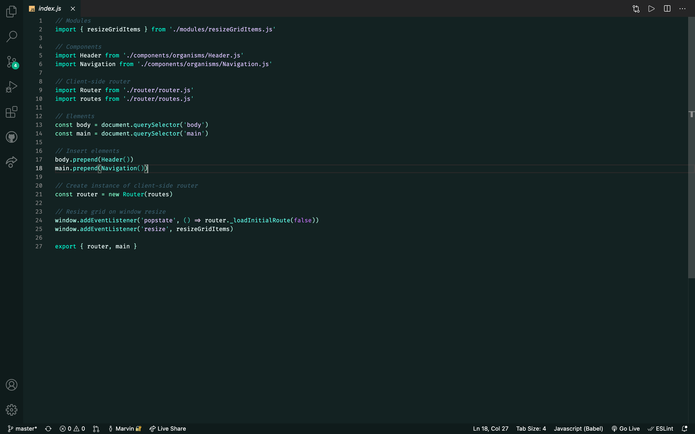
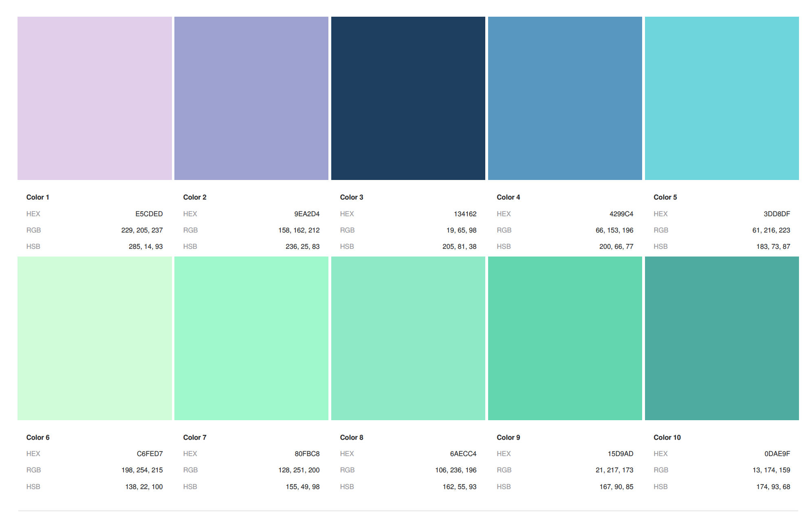

# Aurora Evening

This is a VSCode dark theme based on the colors from an aurora-beam lit sky. The colors dance from bright mint-green to light-blue to purple and pink teints.

## Color Palette

## Font
The used font in our preview is [Fira Code](https://fonts.google.com/specimen/Fira+Code?preview.text_type=custom)

**Enjoy!😊**
