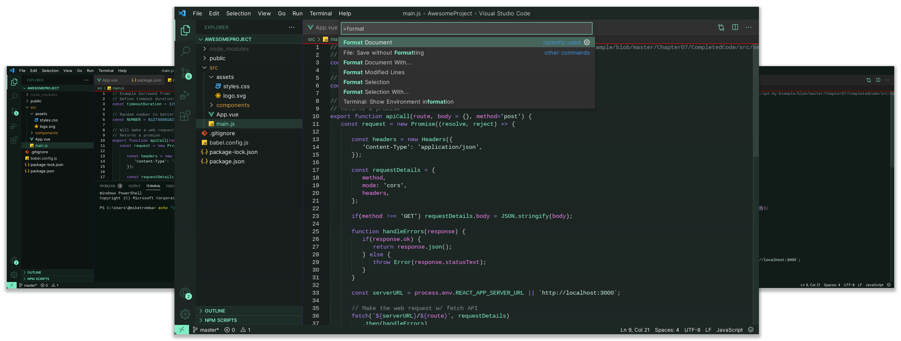
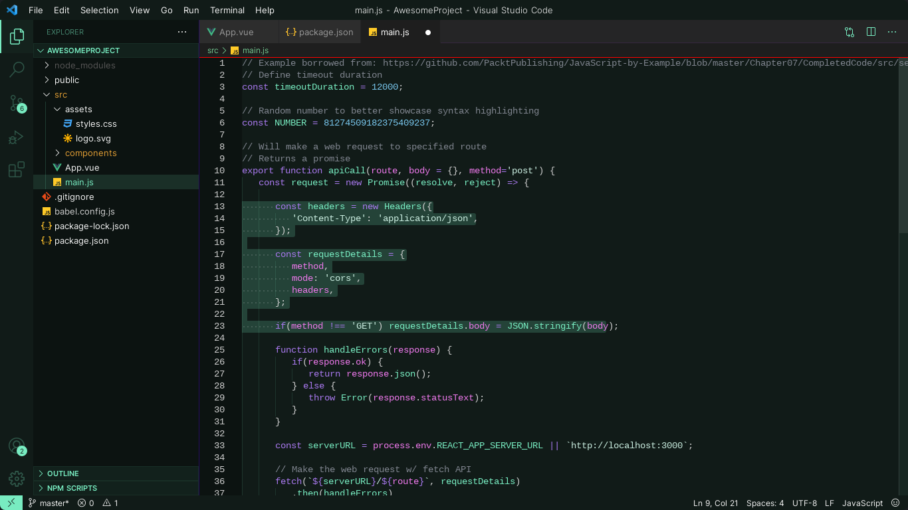
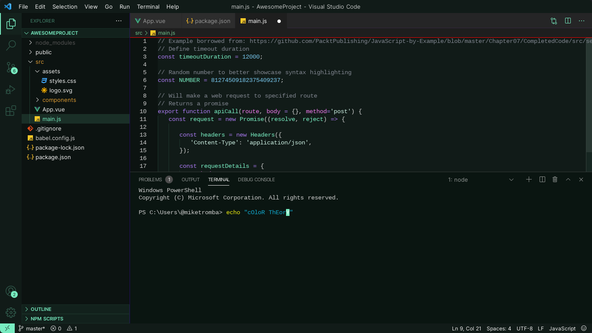

# Aurora Evening


A Visual Studio Code darkmode theme, based on the beauty of the aurora filled night skies.
<br/>

<div style="display:flex;justify-content:center;">
    
</div>
<br/>
<br/>
With a mix of mint-green, purple and blue, this theme represents the natural colors of the polar lights caused by disturbances in the magnetosphere caused by the solar wind.
<br/>
<br/>
<br/>


<br/>
<br/>
<br/>
<div style="display:flex;justify-content:space-between;">
    
    
</div>
<br/>
<br/>

## Install
```
1. Extensions ‣ Search for 'Aurora Evening' ‣ Install
2. Command Palette ‣ Aurora Evening: select theme
```
